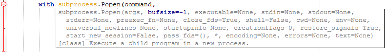

# Generate Python 3 Api

## Introduction

A Python script that executes the [pydoc] module to get the module names.
The module names are imported and the members are inspected with the
[inspect] module.
A generated list containing module, members, call signatures, call type
and documentation.
Lists of module names, builtins and keywords are also collected.

Settings at the top of the script allows the include or exclude of module names
and to set many other options.

It can make files for [SciTE] and [Notepad++] used for autocomplete, calltips,
styling etc.

## Usage

 1. [Customize the settings] at the top of the script to your preference.
 2. Comment or remove code in the main code at the bottom of the script
    if needed.
 3. Execute the script.

View the [Frequently Asked Questions].

## Require

 * [Python] 3.2 or later.
 * The script may report some included modules of failing to import in earlier
   Python versions due to not existing in the earlier versions, which can be
   regarded as acceptable.

## License

[gpl-3.0]

 [gpl-3.0]: http://www.gnu.org/licenses/gpl.html
 [inspect]: https://docs.python.org/3/library/inspect.html
 [pydoc]: https://docs.python.org/3/library/pydoc.html
 [Customize the settings]: settings.md
 [Frequently Asked Questions]: faq.md
 [Notepad++]: https://notepad-plus-plus.org/
 [Python]: https://www.python.org/
 [SciTE]: https://www.scintilla.org/SciTE.html
